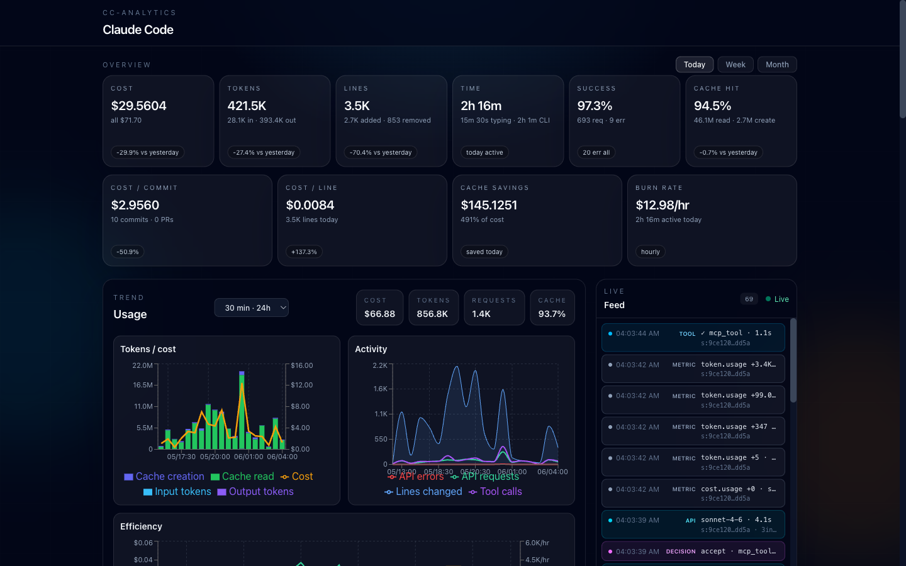
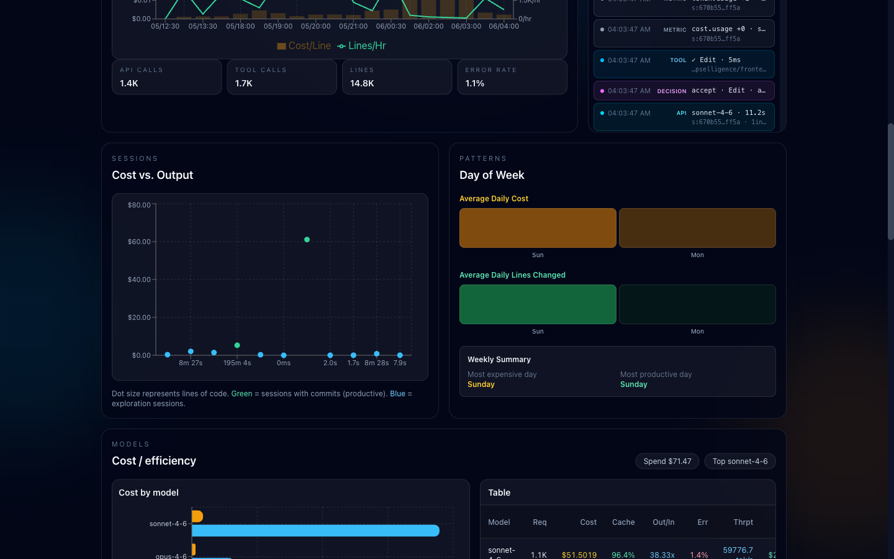
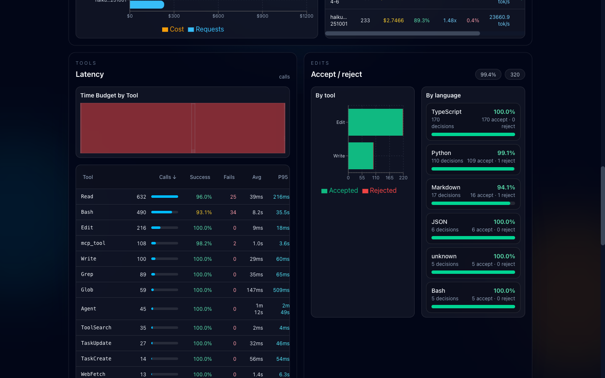
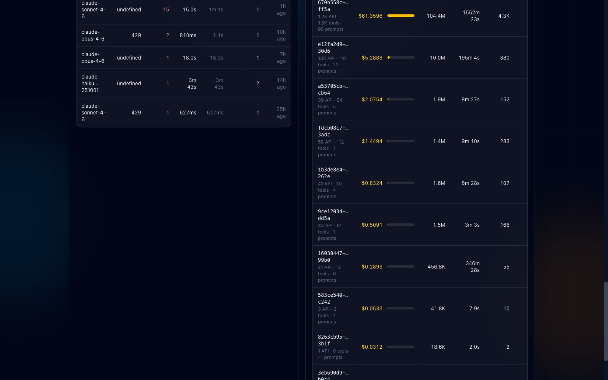

# cc-analytics

A personal telemetry dashboard for [Claude Code](https://claude.ai/code). Collects usage metrics and events via OpenTelemetry and visualises them in a real-time React dashboard — costs, tokens, tool latency, cache efficiency, session patterns, and more.



---

## Table of Contents

- [Features](#features)
  - [Overview KPIs](#overview-kpis)
  - [Usage Trend Chart](#usage-trend-chart)
  - [Live Feed](#live-feed)
  - [Sessions — Cost vs. Output](#sessions--cost-vs-output)
  - [Day-of-Week Heatmap](#day-of-week-heatmap)
  - [Model Breakdown](#model-breakdown)
  - [Tool Latency Table](#tool-latency-table)
  - [Edit Decisions](#edit-decisions)
  - [Sessions Table](#sessions-table)
  - [Error Panel](#error-panel)
- [Architecture](#architecture)
  - [Data Flow](#data-flow)
  - [Backend](#backend)
  - [Database Schema](#database-schema)
  - [REST API](#rest-api)
  - [Frontend Components](#frontend-components)
  - [Key Computed Fields](#key-computed-fields)
- [Getting Started](#getting-started)
  - [Requirements](#requirements)
  - [Install](#install)
  - [Configure Claude Code Telemetry](#configure-claude-code-telemetry)
  - [Run in Development](#run-in-development)
- [Docker Deployment](#docker-deployment)
  - [Run with Docker](#run-with-docker)
  - [Environment Variables](#environment-variables)
- [OTel Reference](#otel-reference)
  - [Metrics](#metrics)
  - [Events](#events)
- [Development Guide](#development-guide)
  - [Project Structure](#project-structure)
  - [Frontend Commands](#frontend-commands)
  - [Tech Stack](#tech-stack)
- [Contributing](#contributing)
- [License](#license)

---

## Features

### Overview KPIs

Ten live cards with a **Today / Week / Month** toggle.

Primary metrics:

| Card | What it shows |
|---|---|
| **Cost** | Spend for the period + all-time total + day-over-day delta |
| **Tokens** | Input + output breakdown |
| **Lines** | Lines added and removed by Claude |
| **Time** | Typing time vs CLI active time |
| **Success rate** | API requests vs errors |
| **Cache hit rate** | Cache-read tokens / total tokens |

Efficiency row:

| Card | Formula |
|---|---|
| **Cost / Commit** | Total spend ÷ number of git commits |
| **Cost / Line** | Total spend ÷ lines of code written |
| **Cache Savings** | USD saved vs paying full input price for cached tokens |
| **Burn Rate** | $/hr while actively working |

### Usage Trend Chart

Stacked area + line chart with a flexible **interval dropdown** (15 min, 30 min, 1 h, 6 h, 12 h, 24 h, daily). Three stacked sub-charts:

1. **Tokens / cost** — cache creation, cache read, input tokens, output tokens, cost overlay
2. **Activity** — API requests, tool calls, lines changed, API errors
3. **Efficiency** — cost/line and lines/hr as dual-axis lines

Summary pills above the chart show period totals for cost, tokens, requests, and cache hit rate.



### Live Feed

Real-time SSE stream rendered as a scrolling list beside the trend chart. Every telemetry event is shown as it arrives with a color-coded type badge:

- `API` — model name, duration, session ID
- `TOOL` — tool name, duration, working directory
- `DECISION` — accept/reject, tool, language
- `METRIC` — metric name and delta value

Keeps the last 100 events in memory. Reconnects automatically with a 3 s back-off.

### Sessions — Cost vs. Output

Scatter plot where each dot is one Claude Code session:

- **X axis** — total cost (USD)
- **Y axis** — session duration
- **Dot size** — lines of code changed
- **Green** — sessions that produced at least one commit (productive)
- **Blue** — exploration sessions (no commits)

Useful for identifying expensive sessions that produced little output.

### Day-of-Week Heatmap

Seven cells (Sun–Sat) with intensity scaled independently for:

- **Amber** — average daily cost
- **Emerald** — average daily lines changed

A weekly summary below shows the most expensive day and the most productive day.

### Model Breakdown

Side-by-side horizontal bar chart and sortable table. Per-model columns:

| Column | Description |
|---|---|
| Req | Request count |
| Cost | Total USD spend |
| Cache | Cache hit rate |
| Out/In | Output-to-input token ratio |
| Err | Error rate |
| Thrpt | Throughput in tokens/s |
| $/req | Average cost per request |
| Cache savings | USD saved via prompt caching |



### Tool Latency Table

Sortable table of every tool Claude invoked, plus a **Treemap** showing time budget distribution by tool. Columns:

| Column | Description |
|---|---|
| Tool | Tool name |
| Calls | Total invocations |
| Success | Success rate % |
| Fails | Absolute failure count |
| Avg | Average duration |
| P95 | 95th-percentile duration |

The table live-updates whenever a new `tool_result` event arrives via SSE — no manual refresh needed.

### Edit Decisions

Two panels side by side:

- **By tool** — stacked bar chart (accepted vs rejected) per tool (`Edit`, `Write`, etc.)
- **By language** — accept rate + absolute counts per language (TypeScript, Python, Markdown, …)

Shows the overall acceptance rate and total decision count in the section header.

### Sessions Table

Full paginated session list with two column presets toggled by a button:

**Standard view:** model, tokens, cost, errors, avg/p95 duration, lines, commits, PRs, age

**Insights view:** depth index, burn rate, tool saturation, $/line

Runaway sessions (unusually high cost or duration) are highlighted in amber.



### Error Panel

API errors grouped by model + HTTP status code. Columns: model, status code, error count, latest occurrence, average duration. Sorted newest first.

---

## Architecture

### Data Flow

```
Claude Code (OTel SDK)
  │
  ├── POST /v1/metrics   OTLP HTTP/JSON  (every 15 s)
  └── POST /v1/logs      OTLP HTTP/JSON  (every 5 s)
            │
      ┌─────▼──────────────────────────────────────┐
      │  backend/main.py  (FastAPI)                 │
      │                                             │
      │  otlp.py  ── unwrap OTel attribute encoding │
      │  db.py    ── write to SQLite (WAL mode)     │
      │                                             │
      │  _subscribers: set[asyncio.Queue]           │
      │       │  broadcast on every ingest          │
      └───────┼─────────────────────────────────────┘
              │
     ┌────────┴──────────┐
     │                   │
  GET /api/*          GET /api/live
  REST endpoints      SSE stream
  (React Query        (one Queue
   polling, 60 s)      per tab)
     │                   │
     └────────┬──────────┘
              │
      React frontend
      (Vite + Recharts)
```

### Backend

Three files, intentionally minimal:

| File | Responsibility |
|---|---|
| `main.py` | FastAPI app. Receives OTLP payloads, serves REST and SSE endpoints, manages the in-process subscriber set. No Redis or external broker. |
| `otlp.py` | Stateless helpers. Unwraps `{"stringValue": "..."}` OTel encoding into plain Python dicts. Merges OTel resource attributes (e.g. `session.id`) into each metric's labels and each event's attrs. |
| `db.py` | All SQLite access. Initialises schema, writes metrics and events, runs all analytical queries. Contains `MODEL_PRICING` dict used for cache-savings calculations. |

**In-process pub/sub** — each connected SSE client gets one `asyncio.Queue`. On every OTLP ingest, `main.py` puts a message on every queue. Dead queues (disconnected clients) are cleaned up on `QueueFull`. No external dependency needed.

### Database Schema

```sql
CREATE TABLE metrics (
  id     INTEGER PRIMARY KEY,
  ts     INTEGER NOT NULL,              -- Unix ms
  name   TEXT    NOT NULL,              -- e.g. "claude_code.token.usage"
  value  REAL    NOT NULL,
  labels TEXT    NOT NULL DEFAULT '{}'  -- JSON blob
);
CREATE INDEX idx_metrics_ts   ON metrics(ts DESC);
CREATE INDEX idx_metrics_name ON metrics(name, ts DESC);

CREATE TABLE events (
  id         INTEGER PRIMARY KEY,
  ts         INTEGER NOT NULL,
  event_name TEXT    NOT NULL,          -- e.g. "api_request"
  session_id TEXT,
  prompt_id  TEXT,
  attrs      TEXT    NOT NULL DEFAULT '{}'  -- JSON blob
);
CREATE INDEX idx_events_ts      ON events(ts DESC);
CREATE INDEX idx_events_session ON events(session_id);
CREATE INDEX idx_events_name    ON events(event_name, ts DESC);
```

SQLite is opened with `PRAGMA journal_mode=WAL` for safe concurrent reads during writes.

JSON label values are queried with SQLite's `json_extract`, e.g. `json_extract(labels, '$."session.id"')` (dot in key name requires quoting).

### REST API

**OTLP ingest (write)**

| Method | Path | Description |
|---|---|---|
| `POST` | `/v1/metrics` | Receive OTLP metrics payload, parse, store, broadcast |
| `POST` | `/v1/logs` | Receive OTLP log records payload, parse, store, broadcast |

**Analytics (read)**

| Method | Path | Params | Description |
|---|---|---|---|
| `GET` | `/api/overview` | — | Today's KPIs + all-time totals |
| `GET` | `/api/daily` | `days` (1–365, default 30) | Daily aggregations + 7-day rolling cost MA |
| `GET` | `/api/hourly` | `hours` (1–72, default 24) | Hourly aggregations |
| `GET` | `/api/30min` | `hours` (1–72, default 24) | 30-minute bucket aggregations |
| `GET` | `/api/12hourly` | `days` (1–30, default 7) | 12-hour bucket aggregations |
| `GET` | `/api/interval` | `interval_hours`, `total_hours` | Custom-interval aggregations |
| `GET` | `/api/models` | — | Per-model token/cost/error/throughput breakdown |
| `GET` | `/api/tools` | — | Per-tool call counts, failure rate, avg/p95 latency |
| `GET` | `/api/decisions` | — | Code edit accept/reject by tool + language |
| `GET` | `/api/sessions` | `limit` (1–500, default 50) | Per-session metrics, newest first |
| `GET` | `/api/errors` | `limit` (1–100, default 25) | API errors grouped by model + status code |
| `GET` | `/api/patterns` | — | Day-of-week productivity averages (0=Sun … 6=Sat) |
| `GET` | `/api/live` | — | SSE stream — one event per telemetry record received |

### Frontend Components

All components are in `frontend/src/components/`. Data fetching uses TanStack Query with a default 60-second refetch interval.

| Component | Data source | Notes |
|---|---|---|
| `OverviewCards` | `/api/overview` + `/api/daily?days=14` | Today/Week/Month toggle; 10 KPI cards |
| `DailyChart` | `/api/daily`, `/api/hourly`, `/api/interval` | Interval dropdown; tokens/cost, activity, efficiency sub-charts |
| `LiveFeed` | SSE `/api/live` | Real-time event stream; last 100 events |
| `SessionScatter` | `/api/sessions?limit=100` | Scatter: cost vs duration, dot size = lines |
| `DowHeatmap` | `/api/patterns` | 7-cell heatmap; amber = cost, emerald = lines |
| `ModelBreakdown` | `/api/models` | Horizontal bar chart + sortable table |
| `ToolTable` | `/api/tools` | Sortable table + treemap; SSE-triggered live updates |
| `EditDecisions` | `/api/decisions` | Stacked bar chart + per-language accept rate table |
| `SessionTable` | `/api/sessions?limit=40` | Standard + insights column preset toggle |
| `ErrorPanel` | `/api/errors` | Errors grouped by model + status code |

Supporting utilities:

| File | Purpose |
|---|---|
| `hooks/useLiveFeed.ts` | Manages `EventSource` connection, 3 s reconnect back-off, last-100 ring buffer |
| `lib/format.ts` | `fmtCompact`, `fmtCurrency`, `fmtPercent`, `fmtDurationMs`, `fmtDurationSeconds`, `shortDate`, `shortId` |
| `lib/pricing.ts` | `MODEL_PRICING` dict ($/M tokens), `calculateCacheSavings()` |

### Key Computed Fields

These fields are derived at query time rather than stored directly.

| Field | Computed in | Formula |
|---|---|---|
| `rolling_7d_cost_usd` | `db.py` | 7-day sliding window sum of `cost_usd` |
| `cache_savings_usd` | `db.py` / frontend | `cache_read_tokens × (input_price − cache_read_price) / 1_000_000` |
| `cache_hit_rate` | `db.py` | `cache_read / (input + cacheRead + cacheCreation)` |
| `cost_per_request_usd` | `db.py` | `cost_usd / request_count` |
| `p95_duration_ms` | `db.py` (SQL) | ROW_NUMBER approximation of 95th percentile over partitioned window |
| `depth_index` | `SessionTable` | `api_calls / prompt_count` — measures how deeply Claude explored per prompt |
| `tool_saturation` | `SessionTable` | `tool_calls / api_calls` — tool use density per request |
| `burn_rate` | `SessionTable` | `cost_usd / (active_time_s / 3600)` |
| `bottleneck_score` | `ToolTable` | `p95_duration_ms / avg_duration_ms` — spike sensitivity |

---

## Getting Started

### Requirements

- **Python 3.12+**
- **Node.js 18+**
- **Claude Code** (any version with OTel telemetry support)
- macOS or Linux (Windows via WSL should work)

### Install

```bash
git clone https://github.com/your-username/cc-analytics
cd cc-analytics
make install
```

`make install` creates a `.venv` Python virtual environment, installs Python dependencies from `backend/requirements.txt`, and runs `npm install` in `frontend/`.

### Configure Claude Code Telemetry

Run once to add the required environment variables to your shell:

```bash
make setup-shell   # idempotent — safe to run multiple times
source ~/.zshrc
```

The command appends the following block to `~/.zshrc`:

```bash
# Claude Code analytics (cc-analytics)
export CLAUDE_CODE_ENABLE_TELEMETRY=1
export OTEL_METRICS_EXPORTER=otlp
export OTEL_LOGS_EXPORTER=otlp
export OTEL_EXPORTER_OTLP_PROTOCOL=http/json
export OTEL_EXPORTER_OTLP_ENDPOINT=http://localhost:6767
export OTEL_METRIC_EXPORT_INTERVAL=15000   # flush metrics every 15 s
export OTEL_LOGS_EXPORT_INTERVAL=5000      # flush events every 5 s
export OTEL_LOG_TOOL_DETAILS=1
```

> If you use bash, fish, or another shell, add those lines to your shell's rc file manually.

### Run in Development

```bash
make dev
```

Starts both processes concurrently:

| Process | URL | Notes |
|---|---|---|
| FastAPI backend | http://localhost:6767 | Hot-reload via uvicorn `--reload` |
| Vite frontend | http://localhost:5173 | HMR; proxies `/api/*` and `/v1/*` to backend |

Run processes individually when needed:

```bash
make backend    # backend only
make frontend   # frontend only
```

Open Claude Code in any project. Telemetry flows automatically — the dashboard populates within the first 15 seconds.

---

## Docker Deployment

Use Docker when you want a persistent, always-on instance that doesn't require running `make dev` manually.

### Run with Docker

```bash
# Build image and start container in background
docker compose up --build -d

# View logs
docker compose logs -f

# Stop
docker compose down

# Stop and delete the database volume
docker compose down -v
```

The app is served at **http://localhost:6767** (backend + pre-built frontend from a single process).

The SQLite database lives in a named Docker volume (`cc-analytics-data`) and survives container rebuilds. To point the container at an existing database file on the host, override `CC_ANALYTICS_DB_PATH` in `docker-compose.yml`.

### Environment Variables

| Variable | Default | Description |
|---|---|---|
| `CC_ANALYTICS_DB_PATH` | `backend/analytics.db` (dev) / `/data/analytics.db` (Docker) | SQLite database path |
| `PORT` | `6767` | Server listen port |
| `TZ` | — | Timezone for day boundaries in aggregations (e.g. `America/New_York`) |


---

## OTel Reference

Claude Code exports telemetry using the OpenTelemetry SDK. cc-analytics receives it over OTLP HTTP/JSON.

### Metrics

Metrics arrive as cumulative sums or gauges on the `/v1/metrics` endpoint.

| Metric name | Labels | Description |
|---|---|---|
| `claude_code.token.usage` | `type` (`input` / `output` / `cacheRead` / `cacheCreation`), `model`, `session.id` | Token counts per API call |
| `claude_code.cost.usage` | `model`, `session.id` | USD cost per API call |
| `claude_code.active_time.total` | `type` (`user` / `cli`), `session.id` | Active time in seconds |
| `claude_code.lines_of_code.count` | `type` (`added` / `removed`), `session.id` | Lines changed by edits |
| `claude_code.commit.count` | `session.id` | Git commits made |
| `claude_code.pull_request.count` | `session.id` | Pull requests opened |
| `claude_code.code_edit_tool.decision` | `tool_name`, `language`, `decision` (`accept` / `reject`) | Edit accept/reject events |

### Events

Events arrive as log records on the `/v1/logs` endpoint.

| Event name | Key attributes | Description |
|---|---|---|
| `api_request` | `model`, `duration_ms`, `session.id`, `prompt.id` | Every Claude API round-trip |
| `api_error` | `model`, `status_code`, `duration_ms`, `attempt` | Failed API calls |
| `tool_result` | `tool_name`, `success` (`"true"` / `"false"`), `duration_ms` | Tool execution result |
| `user_prompt` | `session.id`, `prompt.id` | User message sent |

`session.id` is an OTel **resource attribute** (not a span attribute). `otlp.py` merges it into every metric's `labels` and every event's `attrs` so it's available for grouping queries.

---

## Development Guide

### Project Structure

```
cc-analytics/
├── backend/
│   ├── main.py              # FastAPI app, OTLP receivers, REST + SSE
│   ├── db.py                # SQLite layer, all queries, MODEL_PRICING
│   ├── otlp.py              # OTel attribute parsing helpers
│   ├── requirements.txt     # fastapi, uvicorn[standard], aiosqlite
│   └── analytics.db         # SQLite database file
├── frontend/
│   ├── src/
│   │   ├── App.tsx           # Root layout, QueryClientProvider
│   │   ├── components/       # 10 dashboard components
│   │   ├── hooks/
│   │   │   └── useLiveFeed.ts
│   │   └── lib/
│   │       ├── format.ts     # Formatting utilities
│   │       └── pricing.ts    # Model pricing constants
│   ├── vite.config.ts        # Dev proxy: /api/* → :6767
│   └── package.json
├── Dockerfile                # Multi-stage: Node build → Python runtime
├── docker-compose.yml
├── Makefile
└── CLAUDE.md                 # Notes for Claude Code when working in this repo
```

### Frontend Commands

Run from `frontend/`:

```bash
npm run dev      # Vite dev server with HMR (port 5173)
npm run build    # TypeScript check + production build → frontend/dist/
npm run lint     # ESLint
npm run preview  # Preview the production build locally
```

### Tech Stack

| Layer | Technology |
|---|---|
| Backend language | Python 3.12 |
| Web framework | FastAPI |
| ASGI server | uvicorn |
| Database | SQLite with WAL mode (via aiosqlite) |
| Frontend framework | React 19 + TypeScript |
| Build tool | Vite 8 |
| Styling | TailwindCSS 4 |
| Charts | Recharts 3 |
| Data fetching | TanStack Query v5 |
| Container | Docker + Docker Compose |

The dependency list is intentionally short — 3 Python packages, 4 React runtime packages. No ORM, no message broker, no state management library beyond React Query.

---

## Contributing

1. Fork the repository and create a feature branch
2. Run `make install` then `make dev` to start the full stack
3. Make your changes; add tests if behaviour changes
4. Run `npm run lint` from `frontend/` before pushing
5. Open a pull request with a clear description of what changed and why

Please keep the dependency footprint minimal. Avoid adding abstractions that aren't required by more than one concrete use case.

---

## License

[MIT](LICENSE)
